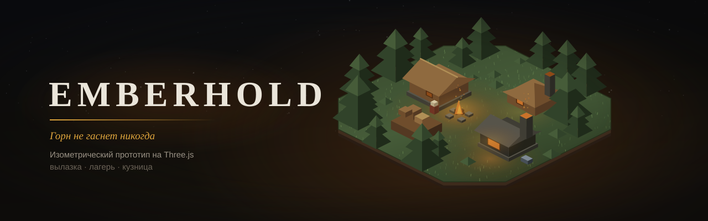

# Emberhold

Emberhold — это лагерь, из которого уходят в вылазку и в который возвращаются.
Локация собирается по сиду и не прощает медлительности: каждый шаг стоит
провианта, ночь съедает обзор, а полнеющий рюкзак с каждым контейнером всё
настойчивее спрашивает — уйти сейчас или дойти ещё до одного. Цена провала
растёт с ярусом: на нулевом не теряется ничего, на третьем — весь рюкзак (§11.2).
Донесённое становится постройкой, постройка меняет следующую вылазку,
и петля замыкается.

Играть: **[batazor.github.io/emberhold](https://batazor.github.io/emberhold/)**.
Это прототип на Three.js — этапы 1–4 из [DESIGN.md](DESIGN.md) §8.

## Что уже играется

Вылазка идёт под ортокамерой в проекции 2:1: герой ходит по клеткам за тапом,
фонарь и ночь спорят за радиус обзора, провиант тает от шагов, боя и вскрытых
контейнеров. Бой начинается сам при сближении — выбор игрока не в том, когда
бить, а в том, ввязываться ли вообще. Здоровье — шкала очков, а «путь назад»
всегда висит на экране, потому что уходить надо, пока хватает шагов.

В вылазку уходят с карты региона (§4). Регион пересобирается каждый день:
полтора-два десятка мест на одном экране, ярусы выпадают как выпадут, и никакой
уровень лагеря их не запирает — цена названа ставкой, а не замком. У каждого
места своё богатство: три захода, которые тратят и игрок, и кланы-фракции,
а покой возвращает. Выработанное место не закрыто, оно просто невыгодно. Кланы
при этом не тикают: их состояние — чистая функция от сида и часов, в сохранении
живут только заходы игрока.

Лагерь встречает четырьмя зданиями и одним слотом стройки. Таймеры выстроены
лестницей от трёх минут до восьми часов, камень их ускоряет, жителей прибавляется
с ростом построек, а прогресс идёт и без игры: сохранение версионированное,
время монотонное, вернувшегося встречает достроенное.

Мастерская — второй сток добычи (§20.1): пока единственный слот стройки занят,
экран возврата предлагает не «ещё вылазку», а ковку, и она идёт без таймера,
по пяти слотам снаряжения (§14). Замер это подтверждает — доля возвратов,
на которых игроку есть что купить, поднимается с 55% до 70% при цели 60–80%
(§20.1); сравнение включается переключателем `NOFORGE=1 npm run play`,
и оба числа берутся из его вывода, а не из памяти.

Сам экран возврата начисляет добычу анимацией и ведёт не к следующей вылазке,
а к трате. Что при этом происходит с игроком, видно в телеметрии §9 — сводка
открывается прямо в лагере кнопкой «Данные».

## Запуск

```bash
npm install
npm run dev        # http://localhost:5173
                   # ?tier=N, ?castle, ?grave — отладочные сцены: кадр
                   #   смотрят адресом, а не проходом игры до него
npm run check      # правила: src/**/*.rules.ts, без браузера
npm run arch       # границы: слои, headless, детерминизм шага, изоляция фич, §
npm run verify     # золотой мастер петли: сдвинулась ли игра
npm run baseline   # перезаписать мастер намеренным изменением
npm run fence      # цена ограды в секундах игрока: замер, а не назначение
npm run measure    # замер добычи и провалов по ярусам, 300 вылазок ботом;
                   # вердикт — монотонность лестницы и причины провалов
npm run models     # обмер наборов моделей; -- --write пересобирает *.data.ts
                   # и каталоги; -- --pack=dungeon — один набор
npm run clips      # обмер набора анимаций: длительности, петли, скорость хода
npm run resample   # прорядка ключей в GLB: отчёт; -- --write переписывает
                   # наборы, после чего клипы перемеряются clips и ual
npm run combat     # дуэли: делают ли Атака и Защита хоть что-нибудь
npm run encounter  # цена присутствия врага — числа для balance.ts
npm run hands      # фонарь или щит: есть ли выбор (§14.2)
npm run ammo       # колчан: решение или бухгалтерия, и аудит §21
npm run fan        # ёмкость дуги под большой палец: со скольких человек
                   #   контрол не обходится без прокрутки (сцена — ?fan)
npm run play       # одна сессия из двадцати вылазок, отчёт для чтения
                   # NOFORGE=1 npm run play — та же сессия без Мастерской (§20.1.2)
npm run build      # typecheck + check + arch + verify + vite build
npm run typecheck
```

## Артбуки

Тридцать одна книга — раскадровки, арт-байбл, живые прототипы механик — лежит
в корне обычными страницами, и вход в них один:
**[artbooks.html](https://batazor.github.io/emberhold/artbooks.html)**.
Слева оглавление с разделами каждой книги и поиском по ним, справа сама книга;
адрес хранит место (`#camp`, `#camp/3`), `[` и `]` листают соседние книги, тема
переключается на всё сразу. Любую книгу по-прежнему можно открыть отдельно.

Список книг в оглавлении написан руками, поэтому `npm run arch` сверяет его
с папкой: новый артбук без строки в оглавлении и разъехавшийся заголовок роняют
сборку. `npm run build` собирает сайт целиком — игра, оглавление и все книги
ложатся в `dist/`; посмотреть собранное можно через `npm run preview`.

## Как устроен код

```
src/
  core/      rng (mulberry32), loop (фиксированный таймстеп), clock (монотонное время)
  sim/       config, types, grid, pathfinding, generate, enemies, raid,
             resources, camp, heroes, gear (снаряжение §14), world (карта §4),
             logging (вырубка леса §13.3), save, session
  render/    scene (камера, свет, ночь), raidView, campView, titleView,
             palette, baked (общее для готовых наборов), forest, skeleton,
             adventurers, *.data.ts — генерируются, не править
  ui/        hud (вылазка), campHud (лагерь), worldMap (карта §4), heroCard,
             avatar (лица NPC: рисуются кодом из вида и сида), startScreen,
             campPrompt (конец пролога), devMenu (только в dev-сборке) —
             DOM поверх канваса
  **/*.rules.ts  проверки лежат рядом с тем, что проверяют
assets/
  LICENSES.md            реестр лицензий (§6.1): чужие ассеты и чужой код
  kaykit-forest/         набор моделей окружения (CC0), источник для запекания
  kaykit-dungeon/        набор предметов подземелья (CC0), измерен, в бандл не едет
  kaykit-skeletons/      набор противников (CC0) со скином, все трое взяты в игру
  kaykit-animations/     набор скелетных клипов (CC0), измерен, в бандл не едет
  kaykit-adventurers/    набор персонажей (CC0), взяты четверо: варвар-герой,
                         рыцарь гарнизона, маг и плут во дворе замка
  kaykit-resources/      набор добычи (CC0), в игру взяты бревно, слитки, обломки камня
  kenney-castle-kit/     модульный замок (CC0), взяты стены конструктора
  kenney-graveyard-kit/  кладбище (CC0), взяты четыре ограды, хвоя, привидение
  kenney-rpg-audio/      набор звуков (CC0), пять имён из четырнадцати
scripts/
  arch.ts        границы, которые раньше приходилось помнить в ревью
  baseline.ts    золотой мастер петли
  fence.ts       цена ограды в секундах игрока: четыре материала — одна цена
  measure.ts     калибровка ярусов ботом
  models.ts      обмер и запекание готовых наборов моделей
  clips.ts       обмер набора анимаций: скорость хода против константы §17.4
  play.ts        печать одной сессии
```

Главное правило здесь одно: **`sim/` не импортирует three**. Симуляция — чистые
данные и функции, её можно гонять в тестах, на сервере и в воркере; рендер
читает состояние, но никогда его не меняет. Из этого же условия вырастает
серверная валидация §6 — её можно будет добавить, не переписывая игру, — и вся
экономика проверяется в Node без браузера: `npm run check` гоняет вылазку
и лагерь как обычные функции.

Второе правило про время: симуляция идёт фиксированным шагом 1/60 с, отрисовка —
с частотой экрана и интерполяцией между тиками (`core/loop.ts`). Лагерь при этом
рисуется на 30 кадрах и замирает через 20 секунд без касаний (camp.html §3).

## Что держит игру изменяемой

Три проверки, и ни одна не про то, что игра работает, — все про то, что её можно
менять вдвоём и втроём, не встречаясь в одном файле.

`npm run check` держит правила рядом с кодом: каждый модуль приносит свой
`*.rules.ts` и никогда не правит общий файл проверок. Раньше проверки жили
в одном `scripts/check.ts`, и любые двое, добавляя своё, встречались в нём.

`npm run arch` заменяет границы, которые иначе приходится помнить: слои знают
только про то, что ниже; `sim/` и `core/` не тянут three и DOM; шаг вылазки
не тянет случайность (§4); фича видна другим только через свой `index.ts`; каждая ссылка `§N` в коде существует
в DESIGN.md; оглавление артбуков совпадает с папкой. Предпоследнее не теория —
`§22` упоминался в четырёх файлах, пока раздела не было.

`npm run verify` хранит золотой мастер петли: восемь детерминированных сессий
по двадцать вылазок, сводка сравнивается с `baseline.json`. Правка боя,
сдвинувшая экономику лагеря, видна сразу и без чтения `camp.ts`. Если сдвиг
намеренный — `npm run baseline`, и diff мастера уезжает в тот же коммит,
объясняя ревью, что именно изменилось в игре.

## Что соответствует документу

**Имена в таблице ниже — рабочие (§0.1).** «Скелет-воин», «Носильщик»,
«Стёганая куртка» и сам «Emberhold» — подписи, чтобы было к чему обращаться;
лора за ними нет, и ссылаться на название как на принятое решение нельзя.
Меняются они правкой поля `name` и ничего за собой не тянут.

| Что | Раздел |
|---|---|
| Ортокамера 45° / 30° — проекция 2:1 | §6 |
| Размер локации по ярусу: 8 / 12 / 16 / 20 | §11.1 |
| Прогулочные места: замок 26–32 клетки, кладбище 24–30 | §6.1.6.1, §6.1.7.1 |
| Замок населён: отряд снаружи, стрелок на стене, маг и плут во дворе | §6.1.6.1 |
| Стены замка гаснут, пока герой во дворе: иначе его самого не видно | §6.1.6.1 |
| Замков и кладбищ на карте по 1–3 в день, сверх раздачи вылазок | §4.1 |
| Провиант: Кухня ур.1 = 50, +20; шаг 1, бой 3, контейнер 5 | §11.1 |
| «Путь назад» в шагах, всегда на экране | §11.1 |
| Ставка ceil(добыча × доля), доли 0 / 30 / 60 / 100% | §11.2 |
| Здоровье — раны (3), а не полоска | §11.3 |
| Обзор = 3 + Знание/5, ночь −1, фонарь +2 — как дальность света | §11.4 |
| Три скелета (названия рабочие, §15), замах 250 / 500 мс, маг не преследует | §15, §17.3 |
| Скорость 1,67 тайла/с как константа дизайна | §17.4 |
| Разворот 120–150 мс | §17.2 |
| Четыре ресурса, кристалл только с ярусов 2–3 | §13 |
| Один слот стройки, потолок по Жилью, площадь 6×6…10×10 | §20.1, §20.4 |
| Таймеры 3 мин / 12 мин / 45 мин / 3 ч / 8 ч | §20.2 |
| Ускорение: 2 камня за минуту, ×1.5 за час, последние 5 минут даром | §20.5 |
| Жителей 2 + по одному на 4 уровня, потолок 10; тап по ним не делает ничего | camp.html |
| Колчан и левая рука покупаются в «Припасах» — стрелы за железо, щит бесплатно | §14.2, §14.3 |
| Сохранение версионированное, время монотонное | §6 |
| Экран возврата: начисление анимацией, полосы важнее добычи, главная кнопка — трата | мокап 04, §20.1 |
| Телеметрия: глубина выхода, провалы, что построено первым, точка выхода, возврат после таймера | §9 |
| Три класса героев, умение раз за вылазку, ротация и лечение 6 мин за рану | §3, §11.7, §11.8, heroes.html |
| Пролог: поляна, провиант как часы, палатка и костёр ставятся игроком на неё же | §16.1 |
| Пролог кончается лагерем: раскладка игрока едет с поляны, дальше — «В мир» и карта | §16.2 |
| Мастерская стоит камня и открывается жильём ур. 2 — первое здание за деньги | §16.2, §20.3 |
| События локации: четыре, выводятся из сида, объявляются картой до входа | §11.6, `world.html` ч. IV |
| Обмен у торговца в замке: курс измерен и намеренно плохой | §13.5, `npm run trade` |
| Первая вылазка идёт в одно место; дальше ярусы отпирает Кухня | §4.1, §16.2 |

## Чего ещё нет

Нет ботов-игроков (§4): чужие метки и лагеря сейчас подаются только сетью
или отладочной ручкой, полноценного поведения соседей ещё нет.

Драфт сборов (§19) появился не целиком: перед входом игрок выбирает одну карту
из трёх, оси в раздаче всегда разные, переброса нет. Карт одиннадцать из
восемнадцати; семь отложены, потому что их эффекты пока нечем честно посчитать
в вылазке, а карта без эффекта в раздачу не кладётся (§19.2).

KayKit Dungeon измерен и лежит в `assets/`, но в бандл пока не едет:
контейнеры, бочки и мебель подземелья ещё не стали игровыми объектами
(§6.1.2, каталог в `dungeonart.html`). Остальные подключённые наборы уже
используются точечно: лес, ресурсы, замок, кладбище, оружие, жители,
инструменты, герой, противники и клипы.

Заданий у жильцов всё ещё нет, и это объявленное состояние: никто ничего
не поручает, тап по ним открывает карточку человека, но не квест. В лагере
есть только мини-задачи текущей петли: крыша, клан, кладовая, припасы и карта.

Уровни 4–6 пересчитаются тем же `npm run measure`, когда цена присутствия
будет переснята под новую расстановку. Сейчас провалы уехали вглубь, встречи
стали реже, и предельная цена на нижних ярусах выродилась в ноль — это про
прибор, а не про числа (§22.6).

Уже не в списке пропусков: мировая карта (§4), события локации (§11.6),
звук (§18), Лазарет и Плац, герои с лечением и тренировкой, пошаговый бой,
ресурсные модели, замок с гарнизоном, кладбище, стены лагеря и оружие в руке.

## Отладка

Ползунки в вылазке и кнопки «Ярус 0–3» в лагере — не игровые механики,
а инструмент проверки: в игре ярус выбирается на мировой карте, а время суток
задаётся локацией. Кнопка «Данные» показывает сводку телеметрии и выгружает
сырые события в буфер обмена. Остальное живёт в адресной строке:

| Параметр | Что делает |
|---|---|
| `?tier=N` | открыть игру сразу в вылазке нужного яруса |
| `?node=N` | открыть конкретное место сегодняшнего региона |
| `?seed=N` | та же локация вместо случайной — для повтора бага и замера |
| `?test`, `?test=walls` | лагерь как тестовый кадр; готовое кольцо стен |
| `?battle=skeleton\|warrior\|mage` | открыть вылазку сразу рядом с нужным врагом |
| `?castle` | замок с гарнизоном и жильцами двора |
| `?grave`, `?grave=СИД` | кладбище: размер участка и ограда выводятся из сида |
| `?meet` | прогалина с сидящим поселенцем |
| `?trail`, `?trail=SEED` | лесная тропа сегодняшнего региона или заданного сида |
| `?wheel`, `?wheel=SEED` | колесо призов сразу, без поиска точки на карте |
| `?town`, `?town=SEED` | улица генератора домов |
| `?fan` | дуга аватаров под большой палец: ёмкость, обвод, упражнение на промахи |
| `?frames`, `?fluffy`, `?shift=N` | кадры раскадровки, луг заставки, сдвиг лагерных часов |
| `?bench=1` | замерный вход: `bench.run(N)`, `bench.luma()`, `bench.night(v)` в консоли |

У отладочных сцен рядом живёт ручка `debug` в консоли. У замка —
`debug.patrol(t)`, `debug.archer(t)`, `debug.dwellers(t)` и `debug.watch(t)`;
у кладбища — `debug.plot()`, у тропы — `debug.trail()`, у города —
`debug.town(seed)` и `debug.houses()`, у колеса — `debug.answer()`.
Пошаговый бой отдельно отдаёт `battle.field()`, `battle.busy()` и
`battle.queue()`, а дуга аватаров — `fan.view()`, `fan.people(n)`,
`fan.radii()` и `fan.results()`.

Кнопка «Новая игра» в левом верхнем углу стирает сохранение и возвращает
на заставку. Она тоже отладочная и живёт только в `npm run dev`: в сборку
ветка не едет.

## Что смотреть в телеметрии

Сводка снабжена ориентирами из документа, потому что цифра без ориентира —
повод для спора, а не решение:

- **Глубина выхода** — ответ на ключевой вопрос §9 «эвакуируются ли слишком
  рано». Ниже половины локации — риск не окупается.
- **Провалов** — где приходит провал (§11.3). Павший обязан заходить глубже
  середины локации и не мельче дошедшего; иначе решение «глубже или назад»
  принимает встреча, а не игрок. Чем нанесён провал — диагностика, а не цель:
  прежние «провиант 65 / бой 35» отменены вместе с автобоем, под который
  писались.
- **Покупка была доступна** — §20.1 целится в 60–80% возвратов.
- **Возврат после таймера** — сравнивать с лестницей §20.2.
